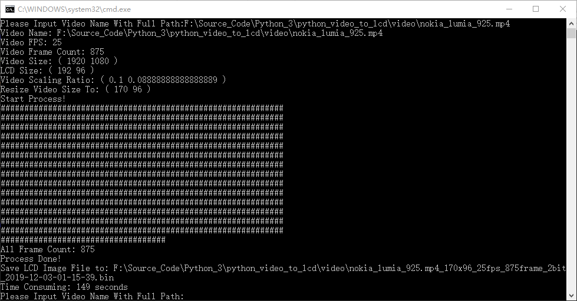
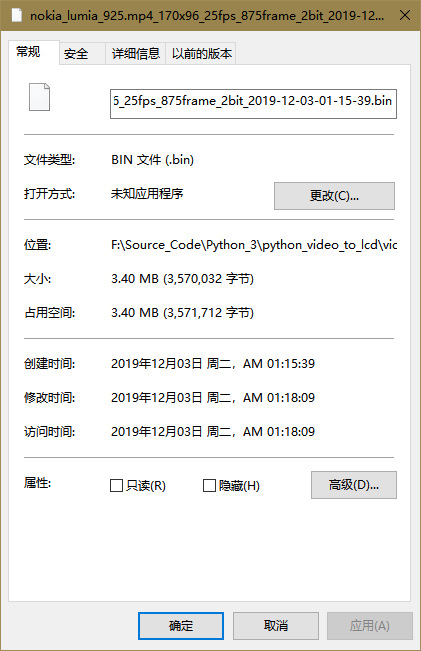

# python video convert to lcd bin

> run log





>  debug log

```sh
x, y, page, col0 =  86 88 22 1
x, y, page, col1 =  86 88 22 64
x, y, page, col0 =  86 89 22 1
x, y, page, col1 =  86 89 22 16
x, y, page, col0 =  86 90 22 1
x, y, page, col1 =  86 90 22 4
x, y, page, col0 =  86 91 22 1
x, y, page, col1 =  86 91 22 1
byte_arry.size, bytei, byten =  4080 3826 85

x, y, page, col0 =  72 80 20 2
x, y, page, col1 =  72 80 20 128
x, y, page, col0 =  72 81 20 1
x, y, page, col1 =  72 81 20 16
x, y, page, col0 =  72 82 20 2
x, y, page, col1 =  72 82 20 8
x, y, page, col0 =  72 83 20 2
x, y, page, col1 =  72 83 20 2
byte_arry.size, bytei, byten =  4080 3472 154
```

